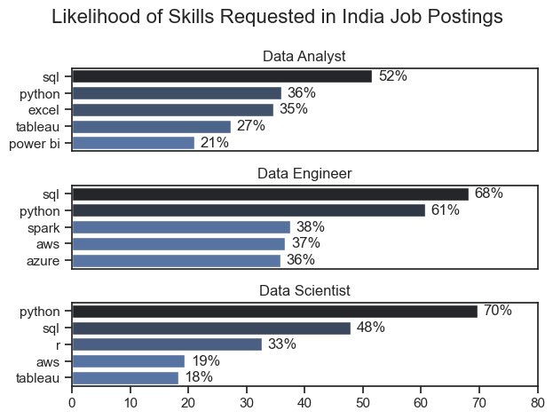
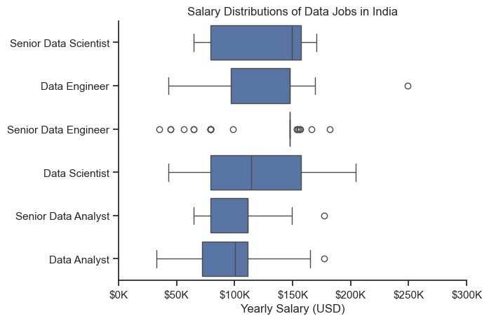
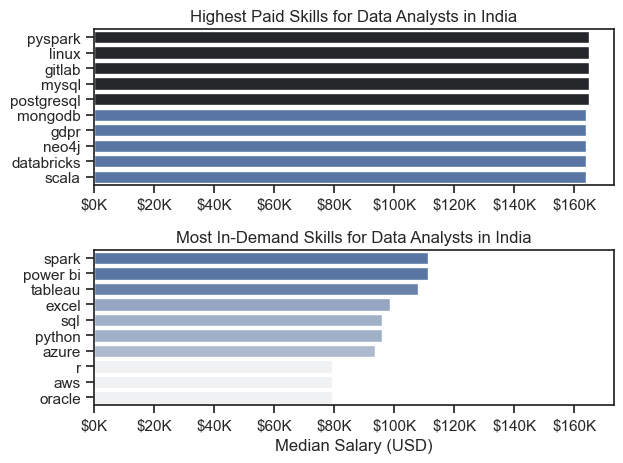
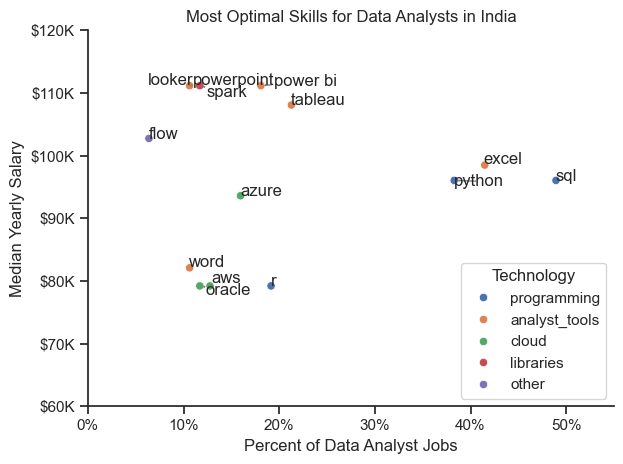

# Overview

Welcome to my analysis of the data job market, focusing on data analyst roles. This project was created out of a desire to navigate and understand the job market more effectively. It delves into the top-paying and in-demand skills to help find optimal job opportunities for data analysts.

The data sourced from [Luke Barousse's Python Course](https://lukebarousse.com/python) which provides a foundation for my analysis, containing detailed information on job titles, salaries, locations, and essential skills. Through a series of Python scripts, I explore key questions such as the most demanded skills, salary trends, and the intersection of demand and salary in data analytics.

# The Questions

Below are the questions I want to answer in my project:

1. What are the skills most in demand for the top 3 most popular data roles?
2. How are in-demand skills trending for Data Analysts?
3. How well do jobs and skills pay for Data Analysts?
4. What are the optimal skills for data analysts to learn? (High Demand AND High Paying) 

# Tools I Used

For my deep dive into the data analyst job market, I harnessed the power of several key tools:

- **Python:** The backbone of my analysis, allowing me to analyze the data and find critical insights.I also used the following Python libraries:
    - **Pandas Library:** This was used to analyze the data. 
    - **Matplotlib Library:** I visualized the data.
    - **Seaborn Library:** Helped me create more advanced visuals. 
- **Jupyter Notebooks:** The tool I used to run my Python scripts which let me easily include my notes and analysis.
- **Visual Studio Code:** My go-to for executing my Python scripts.
- **Git & GitHub:** Essential for version control and sharing my Python code and analysis, ensuring collaboration and project tracking.

# Data Preparation and Cleanup

This section outlines the steps taken to prepare the data for analysis, ensuring accuracy and usability.

## Import & Clean Up Data

I start by importing necessary libraries and loading the dataset, followed by initial data cleaning tasks to ensure data quality.

```python
# Importing Libraries
import ast
import pandas as pd
import seaborn as sns
from datasets import load_dataset
import matplotlib.pyplot as plt  

# Loading Data
dataset = load_dataset('lukebarousse/data_jobs')
df = dataset['train'].to_pandas()

# Data Cleanup
df['job_posted_date'] = pd.to_datetime(df['job_posted_date'])
df['job_skills'] = df['job_skills'].apply(lambda x: ast.literal_eval(x) if pd.notna(x) else x)
```

## Filter Indian Jobs

To focus my analysis on the Indian job market, I apply filters to the dataset, narrowing down to roles based in India.

```python
df_US = df[df['job_country'] == 'India']

```

# The Analysis

Each Jupyter notebook for this project aimed at investigating specific aspects of the data job market. Here’s how I approached each question:

## 1. What are the most demanded skills for the top 3 most popular data roles?

To find the most demanded skills for the top 3 most popular data roles. I filtered out those positions by which ones were the most popular, and got the top 5 skills for these top 3 roles. This query highlights the most popular job titles and their top skills, showing which skills I should pay attention to depending on the role I'm targeting. 

View my notebook with detailed steps here: [2_skills_demand](https://github.com/JonasKaduvakuzhiyil/Python_project_youtube/blob/main/3_Project/2_skills_demand.ipynb)

### Visualize Data

```python
fig, ax = plt.subplots(len(job_titles), 1)


for i, job_title in enumerate(job_titles):
    df_plot = df_skills_perc[df_skills_perc['job_title_short'] == job_title].head(5)[::-1]
    sns.barplot(data=df_plot, x='skill_percent', y='job_skills', ax=ax[i], hue='skill_count', palette='dark:b_r')

plt.show()
```

# Results




# Insights 

## 📊 Insights from Job Posting Skill Analysis (India)

This analysis highlights the **likelihood of specific skills being requested** across three major data roles in India: **Data Analyst, Data Engineer, and Data Scientist**.  
The findings provide a clear view of how skill demands shift depending on the role.

---

<details>
<summary>🔑 Cross-role Trends</summary>

- **SQL + Python are universal**: Both appear across all roles, but their weight changes:  
  - Analysts → SQL-heavy  
  - Engineers → SQL + Python balanced  
  - Scientists → Python-dominant  
- **Visualization tools** (Excel, Tableau, Power BI) are **analyst-centric**, rarely emphasized for engineers or scientists.  
- **Cloud & big data tools** (AWS, Azure, Spark) are **engineer-centric**, reflecting the infrastructure-heavy nature of the role.  
- **Statistical tools** (R) remain relevant only for scientists, showing their focus on modeling and research-driven analysis.  

</details>

---

<details>
<summary>📌 Role-specific Insights</summary>

**1. Data Analyst**  
- SQL (52%) is the backbone skill, with Python (36%) rising as a secondary requirement.  
- Excel (35%) remains surprisingly strong, showing that traditional tools still matter.  
- Visualization (Tableau 27%, Power BI 21%) is a **key differentiator** for analysts.  

**2. Data Engineer**  
- SQL (68%) and Python (61%) are nearly universal requirements.  
- Spark (38%) and cloud platforms (AWS 37%, Azure 36%) highlight the **pipeline + infrastructure focus**.  
- Engineers are expected to **build and scale**, not just analyze.  

**3. Data Scientist**  
- Python (70%) is the undisputed core skill — higher than for any other role.  
- SQL (48%) remains important but secondary.  
- R (33%) shows that **statistical modeling** still has a niche.  
- Cloud (AWS 19%) and visualization (Tableau 18%) are **supporting skills**, not primary.  

</details>

---

<details>
<summary>🚀 Strategic Takeaways</summary>

- **Career progression path:**  
  Analyst → Engineer → Scientist shows a natural shift from **querying & visualization → infrastructure & scaling → modeling & advanced analytics**.  

- **For career pivots:**  
  - Analysts moving to engineering should **add Spark + cloud**.  
  - Engineers moving to science should **deepen Python + statistics (R, ML libraries)**.  

- **For employers:**  
  Job descriptions should be sharper — while overlap exists, the dataset shows **clear skill clusters** that can guide hiring.  

</details>

---

<details>
<summary>🧭 Why This Matters</summary>

For learners and professionals, this dataset provides a **roadmap for skill-building**:  
- Start with **SQL + Python** as the foundation.  
- Layer on **visualization tools** if targeting analyst roles.  
- Add **cloud + big data tools** for engineering.  
- Deepen **statistics + modeling** for data science.  

</details>

---

<details>
<summary>✨ Personal Relevance </summary>

For my own journey, this validates my current focus on **SQL + Python** for analytics, while also highlighting the importance of visualization tools (Power BI/Tableau) for my data professional journey. 
As I expand into engineering and data science, **Spark, cloud, and advanced modeling** will become the next milestones.  

</details>


## 2.How are in-demand skills trending for Data Analysts?

To find how skills are trending in 2023 for Data Analysts, I filtered data analyst positions and grouped the skills by the month of the job postings. This got me the top 5 skills of data analysts by month, showing how popular skills were throughout 2023.

View my notebook with detailed steps here: [3_skills_trend](3_Project/3_skills_trend.ipynb)

### Visualize Data

```python

from matplotlib.ticker import PercentFormatter

df_plot = df_DA_I_percent.iloc[:, :5]
sns.lineplot(data=df_plot, dashes=False, legend='full', palette='tab10')

plt.gca().yaxis.set_major_formatter(PercentFormatter(decimals=0))

plt.show()

```

### Results

  
*Line Graph visualizing the trending top skills for data analysts in India in 2023.*


This visualization tracks the **percentage of job postings requiring specific skills** for Data Analyst roles in India across 2023.  
Skills analyzed: **SQL, Python, Excel, Tableau, Power BI**.

---

<details>
<summary>🔑 Key Observations</summary>

- **SQL dominates** throughout the year, peaking in May (~70%), confirming its role as the backbone skill.  
- **Python demand is steady** (30–45%), with a mid-year peak in June, reflecting its growing importance for automation and scripting.  
- **Excel shows volatility**, with a major spike in June (~60%), proving it remains indispensable for business-facing analysis.  
- **Tableau demand rises mid-year**, peaking in July (~45%), showing visualization tools gain traction seasonally.  
- **Power BI consistently trails** (20–30%), suggesting it’s valued but less frequently required compared to Tableau.  

</details>

---

<details>
<summary>📌 Deeper Insights</summary>

- **SQL as a constant**: Employers consistently prioritize SQL, making it the safest foundational skill.  
- **Python’s upward momentum**: Its mid-year peak signals a shift toward analysts who can handle larger datasets and automation.  
- **Excel’s resilience**: Despite newer tools, Excel’s June surge shows it’s still central to many workflows.  
- **Visualization split**: Tableau outpaces Power BI in demand, but both remain secondary to SQL/Python.  
- **Seasonal hiring patterns**: Peaks in SQL, Excel, and Tableau around mid-year may align with hiring cycles or project launches.  

</details>

---

<details>
<summary>🚀 Strategic Takeaways</summary>

- **For learners**:  
  - Start with **SQL + Excel** for quick entry.  
  - Add **Python** to future-proof your profile.  
  - Layer on **Tableau/Power BI** for visualization credibility.  

- **For career pivots**:  
  - Analysts aiming for advanced roles should strengthen **Python + visualization**.  
  - Those targeting engineering/data science should expand into **cloud + big data tools**.  

- **For employers**:  
  - The steady rise in postings highlights a competitive market.  
  - Clearer job descriptions can help attract candidates with the right skill mix.  

</details>

---

<details>
<summary>✨ Personal Relevance </summary>

For my own journey, this trend validates my focus on **SQL + Python** as the backbone of my analytics dashboard project.  
It also highlights why I’m adding **Power BI/Tableau** for visualization — even if demand is lower, it differentiates my profile.   

</details>

## 3. How well do jobs and skills pay for Data Analysts?

To identify the highest-paying roles and skills, I only got jobs in the United States and looked at their median salary. But first I looked at the salary distributions of common data jobs like Data Scientist, Data Engineer, and Data Analyst, to get an idea of which jobs are paid the most. 

View my notebook with detailed steps here: [4_Salary_Analysis](3_Project/4_salary_analysis.ipynb).

#### Visualize Data 

```python
sns.boxplot(data=df_US_top6, x='salary_year_avg', y='job_title_short', order=job_order)

ticks_x = plt.FuncFormatter(lambda y, pos: f'${int(y/1000)}K')
plt.gca().xaxis.set_major_formatter(ticks_x)
plt.show()

```

#### Results

  
*Box plot visualizing the salary distributions for the top 6 data job titles.*

### Insights

This chart compares the **yearly salary ranges (USD)** for key data-related roles in India.  
It highlights the median, interquartile range (IQR), and outliers for each role.

---

<details>
<summary>🔑 Key Observations</summary>

- **Senior roles command significantly higher medians**:  
  - Senior Data Scientist salaries cluster much higher than Data Scientist roles.  
  - Senior Data Engineer salaries also outpace Data Engineer roles by a wide margin.  

- **Data Engineers vs. Data Scientists**:  
  - Both roles show competitive ranges, but **Data Scientists have higher outliers**, suggesting top-end opportunities in research-heavy or specialized domains.  

- **Analyst roles are the entry point**:  
  - Data Analyst and Senior Data Analyst salaries are notably lower, with narrower ranges.  
  - This reflects their positioning as stepping stones into engineering or science tracks.  

- **Wide salary spreads**:  
  - Outliers in senior roles show that compensation can vary drastically depending on company size, industry, and project complexity.  

</details>

---

<details>
<summary>📌 Deeper Insights</summary>

- **Career ladder clarity**: The box plots visually confirm a clear progression:  
  Data Analyst → Senior Analyst → Data Scientist/Engineer → Senior Scientist/Engineer.  

- **Engineering vs. Science**:  
  - Engineers show more **consistent salary bands** (less volatility).  
  - Scientists show **higher peaks**, rewarding niche expertise in ML/AI.  

- **Market maturity**:  
  - The relatively lower analyst salaries suggest India’s market still treats analysts as entry-level.  
  - The high variance in senior roles indicates a maturing ecosystem where top talent is heavily rewarded.  

</details>

---

<details>
<summary>🚀 Strategic Takeaways</summary>

- **For learners**: Analyst roles are the most accessible entry point, but long-term growth lies in **engineering and science tracks**.  
- **For career pivots**: Building toward **senior engineer/scientist roles** offers the steepest salary growth.  
- **For employers**: Salary variance highlights the need for **transparent benchmarks** to attract and retain talent.  

</details>

---

<details>
<summary>✨ Personal Relevance </summary>

For my own journey, this reinforces why I’m starting with **Data Analyst skills (SQL, Python, visualization)** as a foundation.  
But it also shows the **long-term payoff** of moving into **data engineering (pipelines, cloud)** or **data science (modeling, ML).**

</details>

### Highest Paid & Most Demanded Skills for Data Analysts

Next, I narrowed my analysis and focused only on data analyst roles. I looked at the highest-paid skills and the most in-demand skills. I used two bar charts to showcase these.

#### Visualize Data

```python

fig, ax = plt.subplots(2, 1)  

# Top 10 Highest Paid Skills for Data Analysts
sns.barplot(data=df_DA_top_pay, x='median', y=df_DA_top_pay.index, hue='median', ax=ax[0], palette='dark:b_r')

# Top 10 Most In-Demand Skills for Data Analystsr')
sns.barplot(data=df_DA_skills, x='median', y=df_DA_skills.index, hue='median', ax=ax[1], palette='light:b')

plt.show()

```

#### Results
Here's the breakdown of the highest-paid & most in-demand skills for data analysts in the US:



*Two separate bar graphs visualizing the highest paid skills and most in-demand skills for data analysts in the US.*

#### Insights:

💡 Salary vs. Demand: Data Analyst Skills in India

This comparison highlights the **skills that command the highest salaries** versus those that are **most frequently requested** in job postings.  
It reveals the gap between what employers *want most* and what they’re *willing to pay a premium for*.

---

<details>
<summary>🔑 Key Observations</summary>

- **Highest Paid Skills**:  
  - Specialized tools like **PySpark, Linux, GitLab, Databricks, Scala** top the salary list.  
  - These are less common in analyst roles, but when required, they command a premium.  

- **Most In-Demand Skills**:  
  - **Spark, Power BI, Tableau, Excel, SQL, Python** dominate job postings.  
  - These reflect the *core toolkit* employers expect from analysts.  

- **Mismatch**:  
  - High-paying skills (e.g., PySpark, Databricks) are not the most in-demand.  
  - In-demand skills (Excel, SQL, Power BI) don’t always translate to higher salaries.  

</details>

---

<details>
<summary>📌 Deeper Insights</summary>

- **Market maturity**: Employers pay more for **engineering-adjacent skills** (PySpark, Databricks, Scala) because they blur into data engineering.  
- **Breadth vs. depth**: Analysts with **breadth (Excel, Power BI, SQL)** are widely employable, but those with **depth in niche tools** can negotiate higher pay.  
- **Compliance premium**: Skills like **GDPR** appear in the high-salary list, showing that regulatory expertise adds value in global-facing roles.  
- **Open-source databases** (PostgreSQL, MongoDB, Neo4j) also feature in the high-salary list, reflecting demand for flexibility beyond traditional SQL.  

</details>

---

<details>
<summary>🚀 Strategic Takeaways</summary>

- **For learners**:  
  - Build a **core stack** first: SQL + Python + Excel + Power BI/Tableau.  
  - Then layer on **niche, high-paying skills** (PySpark, Databricks, Linux) to stand out.  

- **For career pivots**:  
  - If you’re already strong in SQL/Python, adding **big data + compliance skills** can unlock higher salary bands.  

- **For employers**:  
  - The gap between demand and pay suggests a need to **rethink compensation** — common skills are undervalued, while niche skills are overvalued due to scarcity.  

</details>

---

<details>
<summary>✨ Personal Relevance </summary>

For my own journey, this chart validates my focus on **SQL + Python + Power BI** as the in-demand foundation for my analytics dashboard.  
But it also signals a future opportunity: adding **PySpark/Databricks** could position me closer to the **high-paying engineering–analytics overlap**.

</details>

## 4. What are the most optimal skills to learn for Data Analysts?

To identify the most optimal skills to learn ( the ones that are the highest paid and highest in demand) I calculated the percent of skill demand and the median salary of these skills. To easily identify which are the most optimal skills to learn. 

View my notebook with detailed steps here: [5_Optimal_Skills](3_Project/5_optimal_skills.ipynb)

#### Visualize Data

```python
from adjustText import adjust_text
import matplotlib.pyplot as plt

plt.scatter(df_DA_skills_high_demand['skill_percent'], df_DA_skills_high_demand['median_salary'])
plt.show()

```

#### Results

    
*A scatter plot visualizing the most optimal skills (high paying & high demand) for data analysts in India.*

#### Insights:


This scatter plot compares **skill demand (% of job postings)** with **median yearly salary (USD)**.  
It helps identify which skills are both **widely requested** and **well-compensated**, versus those that are niche but lucrative.

---

<details>
<summary>🔑 Key Observations</summary>

- **High demand + solid pay**:  
  - **SQL and Excel** sit in the sweet spot — widely requested and offering competitive salaries.  
  - **Python** also balances strong demand with good compensation.  

- **High pay, low demand**:  
  - **Looker, PowerPoint, Spark** show the highest salaries but appear in fewer postings.  
  - These are niche skills that command a premium due to scarcity.  

- **Visualization tools**:  
  - **Tableau and Power BI** are moderately in demand but don’t push salaries as high as core programming/database skills.  

- **Cloud skills (AWS, Azure)**:  
  - Present but less dominant for analysts, suggesting they’re more critical in engineering roles.  

</details>

---

<details>
<summary>📌 Deeper Insights</summary>

- **SQL + Excel resilience**: Despite being “old school,” they remain the most *practical* skills for analysts in India.  
- **Python’s versatility**: Its balance of demand and salary shows it’s becoming a baseline expectation, not just a bonus.  
- **Niche premium**: Tools like **Looker** or **Spark** may not appear often, but when they do, they’re tied to specialized, higher-paying roles.  
- **Category split**:  
  - *Programming (SQL, Python)* → high demand, strong pay.  
  - *Analyst tools (Excel, Tableau, Power BI)* → high demand, moderate pay.  
  - *Cloud & libraries (AWS, Spark)* → lower demand, higher pay.  

</details>

---

<details>
<summary>🚀 Strategic Takeaways</summary>

- **For learners**:  
  - Build a **core trio**: SQL + Python + Excel.  
  - Add **Tableau/Power BI** for visualization credibility.  
  - Layer on **niche skills (Spark, Looker, cloud)** later to unlock higher salary bands.  

- **For career pivots**:  
  - If you already have the basics, targeting **one niche premium skill** (e.g., Spark or Databricks) can differentiate you.  

- **For employers**:  
  - The mismatch between demand and pay suggests a need to **balance hiring strategies** — don’t undervalue common skills that drive most analyst workflows.  

</details>

---

<details>
<summary>✨ Personal Relevance </summary>

For my own journey, this chart validates my focus on **SQL + Python + Excel** as the backbone of my analytics dashboard.  
But it also highlights a future opportunity: adding **Spark or cloud tools** could position me closer to the **high-paying analyst–engineer overlap**, which aligns with scaling Trado Ventures’ export insights platform.  

</details>

# What I Learned

Throughout this project, I deepened my understanding of the data analyst job market and enhanced my technical skills in Python, especially in data manipulation and visualization. Here are a few specific things I learned:

- **Advanced Python Usage**: Utilizing libraries such as Pandas for data manipulation, Seaborn and Matplotlib for data visualization, and other libraries helped me perform complex data analysis tasks more efficiently.
- **Data Cleaning Importance**: I learned that thorough data cleaning and preparation are crucial before any analysis can be conducted, ensuring the accuracy of insights derived from the data.
- **Strategic Skill Analysis**: The project emphasized the importance of aligning one's skills with market demand. Understanding the relationship between skill demand, salary, and job availability allows for more strategic career planning in the tech industry.


# Insights

This project provided several general insights into the data job market for analysts:

- **Skill Demand and Salary Correlation**: There is a clear correlation between the demand for specific skills and the salaries these skills command. Advanced and specialized skills like Python and Oracle often lead to higher salaries.
- **Market Trends**: There are changing trends in skill demand, highlighting the dynamic nature of the data job market. Keeping up with these trends is essential for career growth in data analytics.
- **Economic Value of Skills**: Understanding which skills are both in-demand and well-compensated can guide data analysts in prioritizing learning to maximize their economic returns.


# Challenges I Faced

This project was not without its challenges, but it provided good learning opportunities:

- **Data Inconsistencies**: Handling missing or inconsistent data entries requires careful consideration and thorough data-cleaning techniques to ensure the integrity of the analysis.
- **Complex Data Visualization**: Designing effective visual representations of complex datasets was challenging but critical for conveying insights clearly and compellingly.
- **Balancing Breadth and Depth**: Deciding how deeply to dive into each analysis while maintaining a broad overview of the data landscape required constant balancing to ensure comprehensive coverage without getting lost in details.


# Conclusion

This exploration into the data analyst job market has been incredibly informative, highlighting the critical skills and trends that shape this evolving field. The insights I got enhance my understanding and provide actionable guidance for anyone looking to advance their career in data analytics. As the market continues to change, ongoing analysis will be essential to stay ahead in data analytics. This project is a good foundation for future explorations and underscores the importance of continuous learning and adaptation in the data field.
